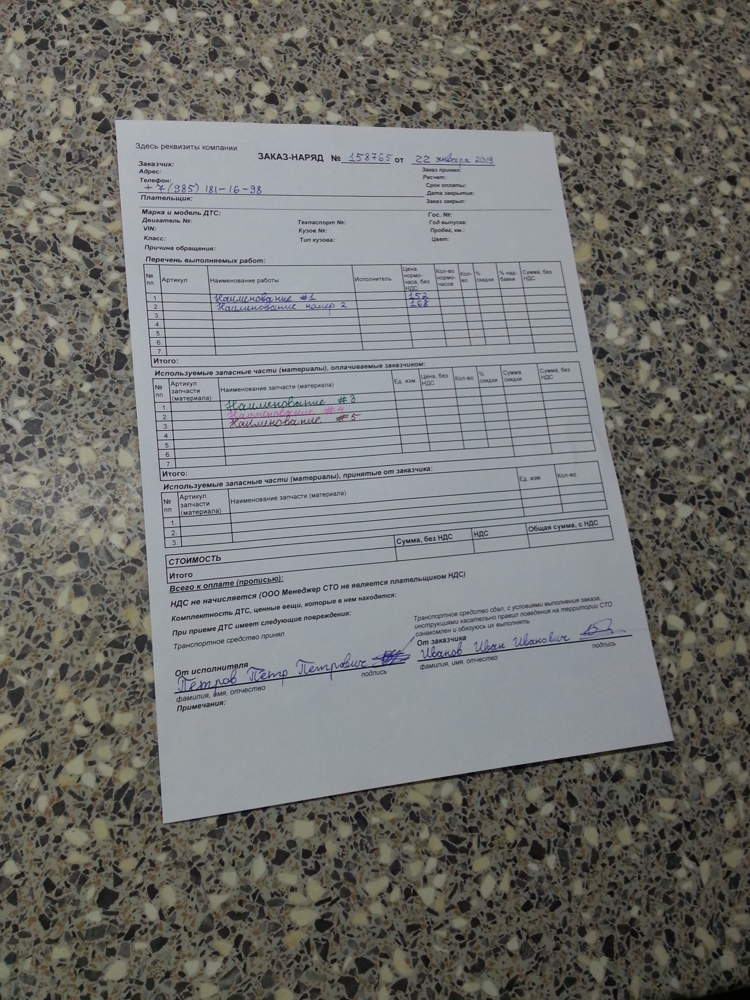
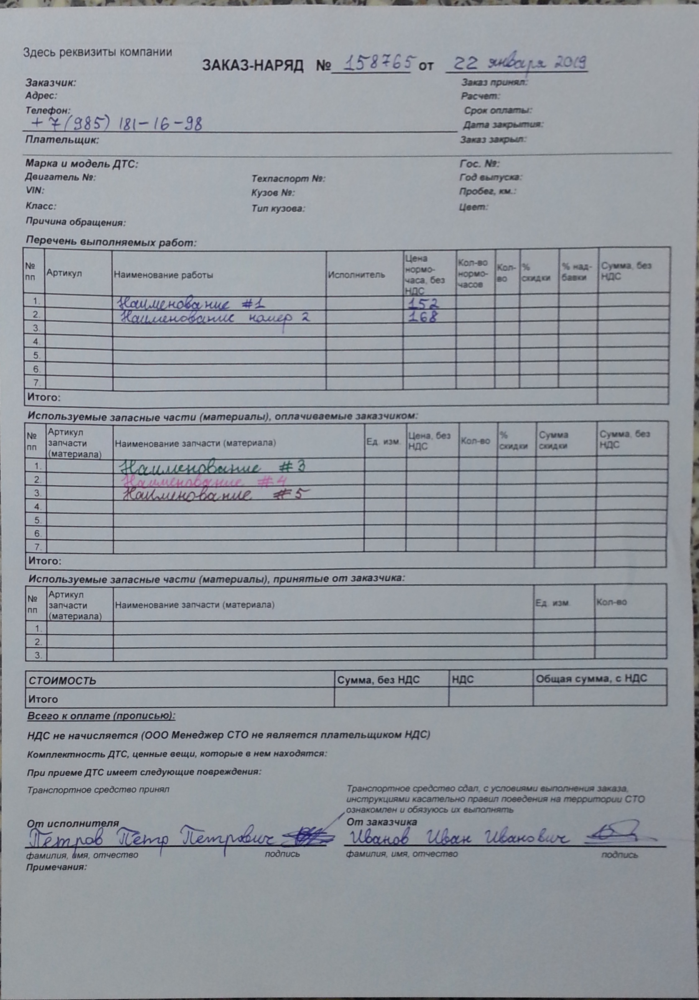
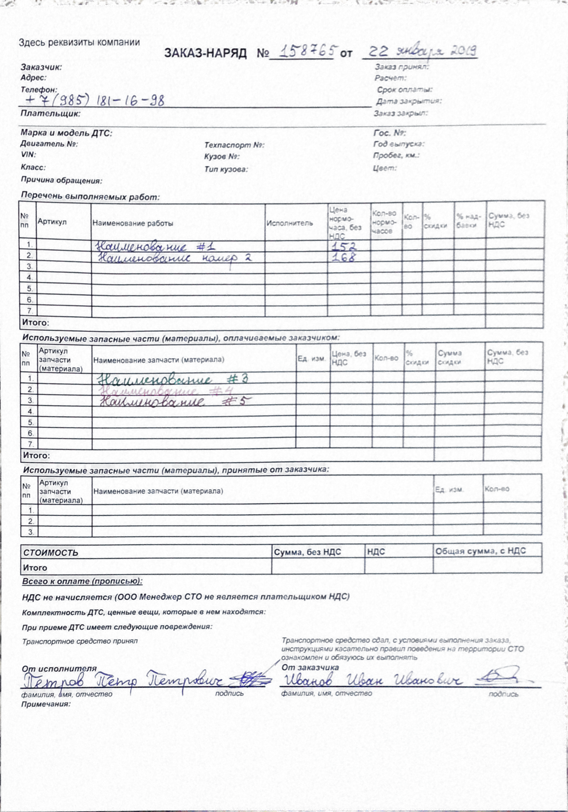

# Correction of distortions in images of documents

This work is a bachelor thesis on the topic "Correction of distortions in images of documents". This repository contains implementation of algorithms of perspective distortion correction and illumination correction. 

Example of functioning of suggested algorithms:

  
   
  

